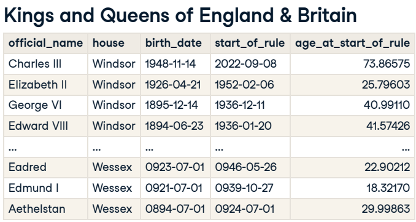
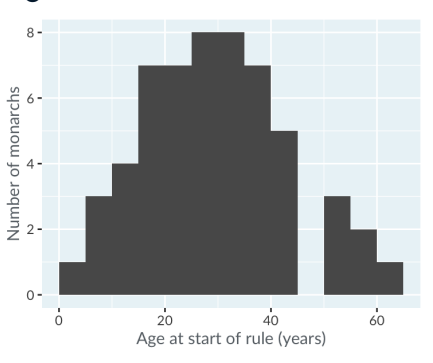
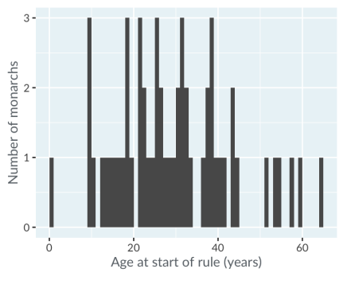
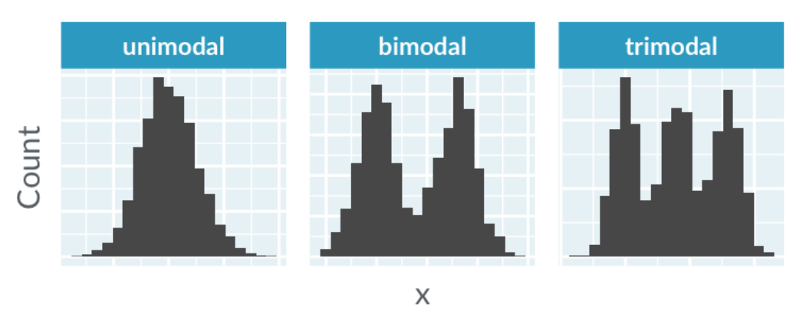
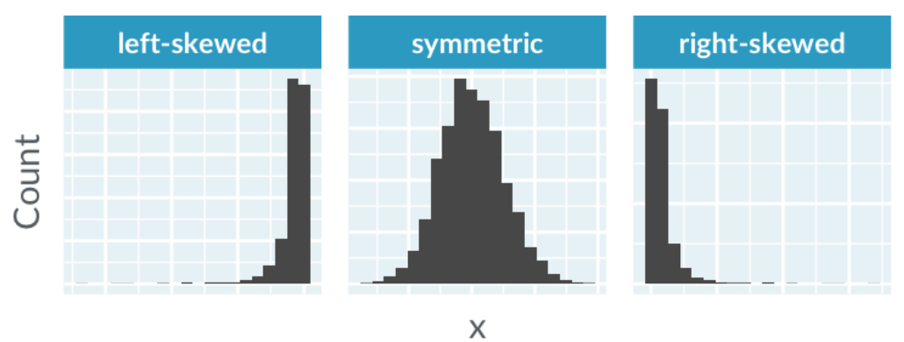
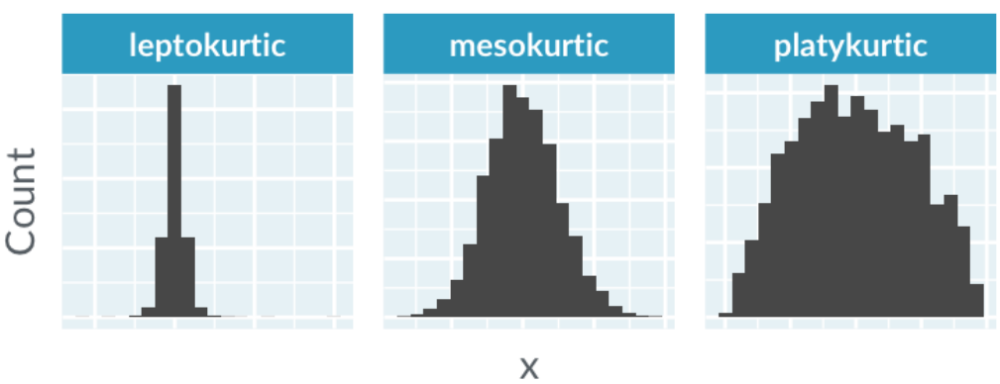
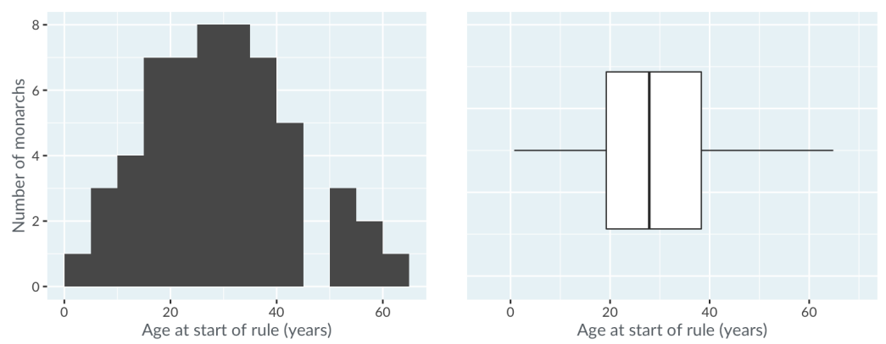
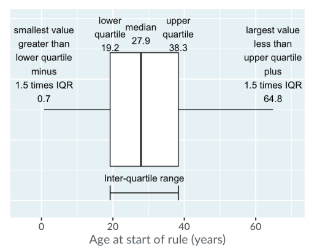

# Visualizing distributions

## Introduction

There are three ways of getting insights:

- Calculating summary statistics, like mean, median and standard deviation
- Running models like linear regression
- Drawing plots, like scatter, bar and histogram

### Types of variables

Usually we have two types of variables, continuous and categorical.

1. Continuous variables
   - These are variables thatcan take any numerical values within a range and they have infinite number of possible values within a given interval.
   - Examples: height, temperature, weight
  
2. Categorical variables
    - These are variables that can take on one of a limited and usually fixed number of possible values or categories.
    - Are usually text
    - Examples: eye colors, countries

Any value can be either a continuous or categorical variable. For example, age is continuos but age group (0-5 yo, 6-7 yo) is categorical. Time is continuous, but month of year is categorical.

## Histograms

### When should be used

- If there is a single continuous variable
- If the questions are about the shape of its distribution

#### Example

The appearance of a histogram is strongly influenced by the choice of binwidth. But the only way to calculate the binwidth is testing different widths.

Kings and Queens of England & Britain

Histogram of age at start of rule
In the graphic below the bin width is igual to 5 years

For example, choosing a bin width of 1 year gives us a different graphic, with more peaks and gaps, making it very noise.This way is difficult to have a general conclusions.

BVut, choosing a binwidth of 25 years is also not good,because its not possible to see any detail in the distribution, making it harder to get any conclusions.

### Modality

Modality of the distribution basically how many pics there are.

### Skewness

Skewness is about the symmetry of the distribution.

### Kurtosis

Kurtosis is about how many extreme values is in the distribution.

## Boxplots 

### When should be used

- When there's a continuous variable, split by a categorical variable
- When there is a need to compare the distribution of the continuous variable for each categgory.

### Histogram vs. box plot

### Characteristics of box plot

The line in the middle shows the median of the distribution. 

The box in the box plot extends from the lower quartile to the upper quartile. The lower quartile is the point where one quarter of the values are below it. In this exaple means that one quarter of the monarchs started ruling before median age, and three quarters after it. 

The difference between the upper quartile and the lower quartile is called the inter-quartile range.

The horizontal lines is known as "whiskers".

Each bar extends to one and a half times the interquartile range, but then they are limited to reaching actual data points.

To simplify, the whiskers is extending far enough that anything outside of them is an extreme value.
