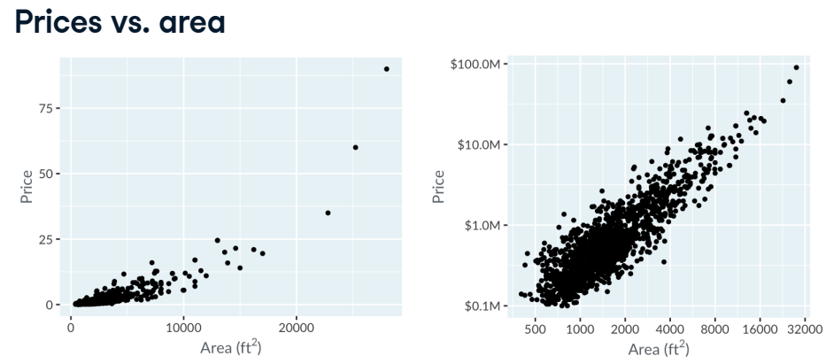
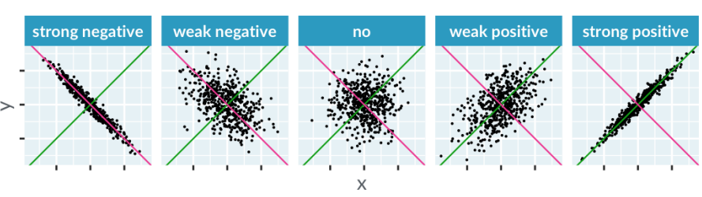
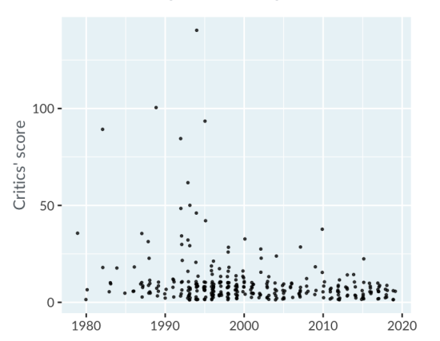
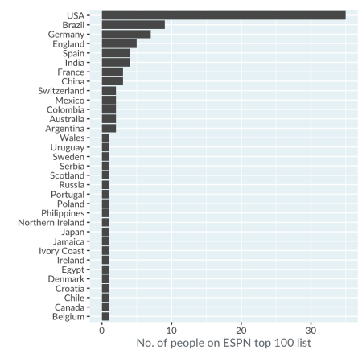
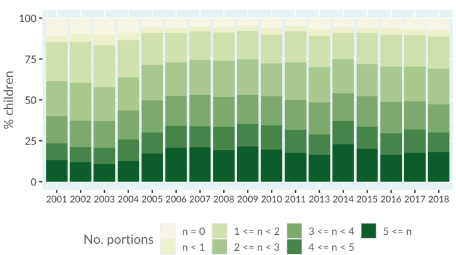
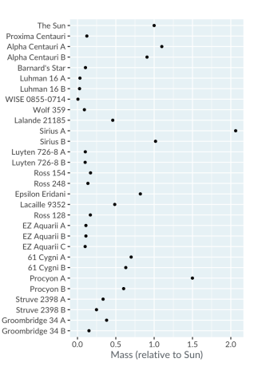

# Visualizing two variables

## Scatter plots

### When should be used

- There are two continuous variables
- The question is about the relationship between the two variables 

### Correlation types

How close the dots are to being able to fit in a straight line through them

When a straight trend line is a poor fit, one alternative is to use a curve

## Line plots

### When should you use a line plot

- There are two continuous variables
- The question is about the relationship between the two variables
- Consecutive observations are connected somehow

Usually, but not always, the x-axis is dates or times.

Can be used for:

- Comparing multiple lines
- trend lines
- trend lines + log scale

The time x-axis doesn't always imply line plot

## Bar plots

### When should be used

Most common cases:
- There is a categorical variable
- The goal is to count or have a percentage for each category

Occasionally:
- There is another numeric score for each category, and need to include zero in the plot

Examples:

,

Ehe bars can be stacking too. This type of graphic is called stacking bars

## Dot plots

### When should be used

- There is a categorical variable
- There is a need to isplay numeric scores for each category on a log scale, or multiples numeric scores for each category

