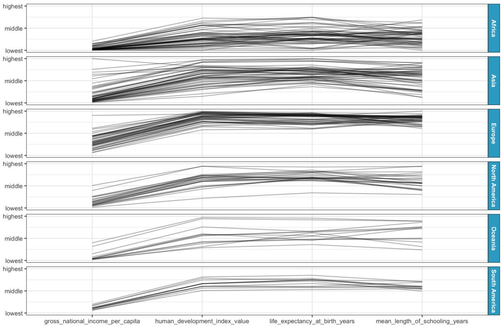
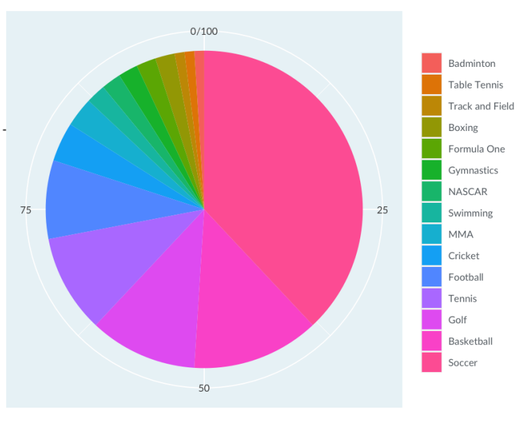

# The color and the shape

## Higher dimensions

The x and y axis are not the only dimensions. To show insights, you can also use different dimensions like:

### For points

- Color
  - You can clealy see the correlation between the variables in the x and y axes
  - You cant precisely see the value for each color, you can only estimate
  - Example:

- Size
  - Larger points can be seem more important and tend to overlap
  - You cant precisely see the value for each size, you can only estimate
  - Example:

- Transparency
  - Less transparent points can be seem more important
  - You cant precisely see the value for each point, you can only estimate
  - Example

- Shape
  - you have to memorize which shape corresponds to which age range
  - shapes have no natural ordering from smallest to largest. 
  - Example:

- Subset the data and use more than one panel for each
  - Good to dertmine trends across the groups
  - Be careful with the amout of subsets and consequently  of the number od panels
    - A large amout of panels can take more space and make the user spende more time moving the eyes
    - Make interpretating harder

### For line plots

- Color

- Thickness
- Transparency
- Line type (solid, dashes, dots)

## Using color

Is the most powerful tool for distinguishing data values.

### Choosing a plotting palette

- Usually, each color should stand out as much as other colors
- The perceptual distance from one color in the plot to the next should be constant

#### Colorspaces

The colorspace designed for data visualization is called hue-chroma-luminance, or or HCL.
It's designed to deal with issues of color perception. 

- Chroma is the intensity of the color, from grey to a bright color
- Luminance is the brightness of the color, from black to white.
- Hue is like the color of the rainbow, from red, through orange, green and blue, to purple and back to red.

#### Types of color scales

- Qualitative color scales
  - Used to distinguish unordered categories
  - Usually involve changing the hue, while keeping chroma and luminance fixed.
- Sequential
  - Emphasize ordering in the data
  - Most sequential scales change either chroma or luminance, while keeping hue fixed.
- Diverging
  - Emphasizes whether values are greater than or less than some middle value
  - Have a neutral color like white or gray in the middle, and have increasingly bold colors with different hues on either edge.

## Plotting many variables at once

### Pair plot

#### When use it

- Very helpful for quickly exploring a new dataset
- There is up to ten variables, no matter the type
- The goal is to see the distribution for each variable
- The goal is also see the relationship between each pair of variables

#### Characteristics

- Panels on the diagonal show distributions of variables.
  - City is a categorical variable, so was represented as a bar plot
  - The others are continuos, so was represented by histograms
- Panels off the diagonal show relationships between pairs of variables. 
  - When both variables are continuous, it is possible to see scatter plots of each pair of variables, and their correlation
- The most externals panels
  - When comparing a categorical variable to a continuous variable is possible to use a box plot and a histogram of the continuous variable split by the categorical variable. 

### Heatmap

#### When use it

- There is lots of continuous variables.
- For a simple overview of how each pair of variables is related.

### Parallel coordinates

#### When to use it 

- There is a lot of continuous variables
- The goal is to find patterns across these variables
- Or visualize clusters of observations
- More metrics can just be added to the x-axis. You can easily compare ten or twenty variables at once.

### Polar coordinates

- Should be used almost never
- Just if there is a variable that is naturally circular (ex.: time of the day, compass direction)

#### Pie plot

- Bar plot + polar coordinates

#### Rose plot

- Histogram + polar coordinates

## Sensory overload

### Measures of  good visualization

- How many interesting insights can your reader get from the plot?
  - Is hard to get a good visualization when there is too many plots
- How quickly can they get those insights?
  - Often, there is a need to get your message across quickly

### Chartjunk

- Refers to anything in the plot that makes it harder for the reader to get insight into the data
- Example: 
  - Pictures
  - Skuemorphisms: shadowns, etc
  - extra dimensions
  - Ostentatious colors or lines

## Summary

- Histograms: show a distribution
- Box plots: show lots of distributions at the same time
- Scatter plots: compare two numeric variables
- Line plots: show trends over time
- Bar plots: show counts by category
- Dot plots: show log scale metrics by category
- Bar plots: show log scale metrics by category
- Pair plot: compare many variables
- Correlation heatmap: show related variables 
- Parallel correlation plot: find patterns across variables
- Rose plot: show cyclical distribution